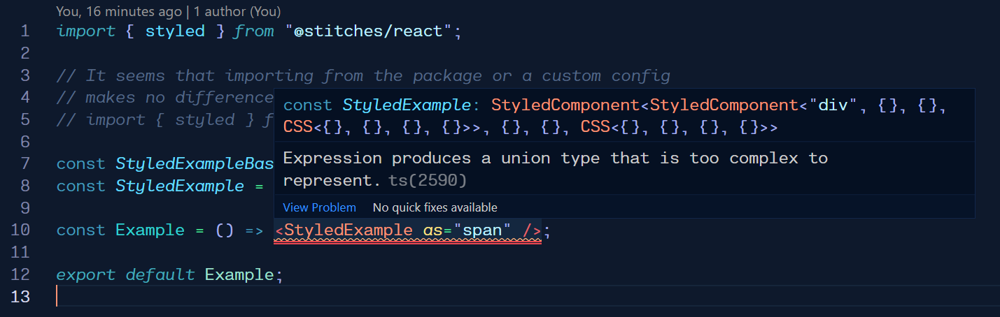

# Stitches component composition TS error

When composing components (as described in the [Stitches Docs](https://stitches.dev/docs/composing-components)), and using the `as` prop (seen [here in the docs](https://stitches.dev/docs/overriding-styles#overriding-the-html-tag)), a Typescript error is produced in VS Code and Webstorm.

The error produced:

```
Expression produces a union type that is too complex to represent.ts(2590)
```

A screenshot of the VSCode error:


When bundling with Typescript or running `tsc`, no error was produced for me. This lead me to believe it was just some VS Code issue, but Webstorm also produced the error. I've found this error in various Github issues but usually not with Stitches. MUI seemed to have the problem once, and Stitches has a closed issue that was fixed when going from beta to v1.
